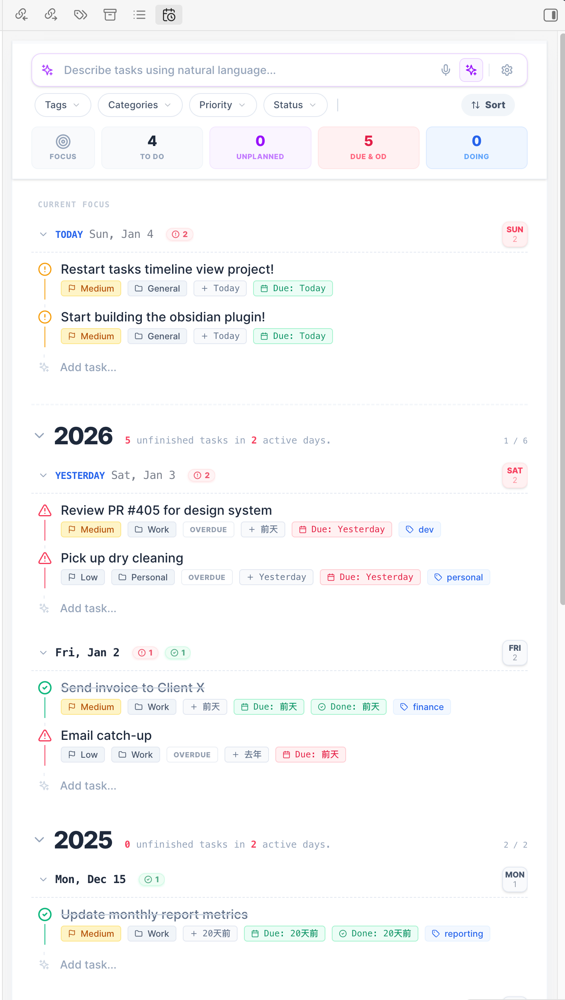

# Tasks Timeline View for Obsidian



This is a view plugin to show and manage your task items in Obsidian. It is a continuation of [obsidian-tasks-calendar-wrapper](https://github.com/Leonezz/obsidian-tasks-calendar-wrapper),
based on [tasks-timeline-components](https://github.com/Leonezz/tasks-timeline-components).

## MCP Server

The plugin includes a built-in [Model Context Protocol (MCP)](https://modelcontextprotocol.io/) server that lets AI agents read and write tasks in your vault.

### Setup

1. Open **Settings > Tasks Timeline > MCP Server**
2. Toggle **Enable MCP Server** on
3. The server starts on `http://127.0.0.1:27182/mcp` (port is configurable)

### Connecting AI Clients

Add the following to your MCP client configuration (e.g. Claude Desktop, Claude Code, Cursor):

```json
{
  "mcpServers": {
    "tasks-timeline": {
      "url": "http://127.0.0.1:27182/mcp"
    }
  }
}
```

### Available Tools

| Tool | Description |
|------|-------------|
| `query_tasks` | Search and filter tasks by status, category, tags, date range, and free-text |
| `create_task` | Create a new task with title, priority, dates, tags, and recurrence |
| `update_task` | Update an existing task by ID (partial updates supported) |
| `delete_task` | Delete a task by ID |
| `complete_task` | Mark a task as done (handles recurring tasks) |
| `cancel_task` | Cancel a task or recurring series |
| `batch_update_tasks` | Update multiple tasks matching a filter |
| `get_task_stats` | Get aggregate statistics (counts by status, priority, category) |
| `get_today_plan` | Get tasks due today and overdue tasks sorted by priority |

### Available Resources

| Resource | URI | Description |
|----------|-----|-------------|
| All Tasks | `tasks://all` | List of all tasks |
| Task by ID | `tasks://task` | Retrieve a single task |
| Overdue | `tasks://overdue` | Tasks that are past due |
| Today | `tasks://today` | Tasks due or starting today |
| Upcoming | `tasks://upcoming` | Tasks due in the next 7 days |
| Stats | `tasks://stats` | Aggregate task statistics |

### Available Prompts

| Prompt | Description |
|--------|-------------|
| `plan_my_day` | Review today's tasks and create a prioritized daily plan |
| `weekly_review` | Review task progress and suggest priorities for next week |
| `task_triage` | Identify stale tasks and suggest actions |

